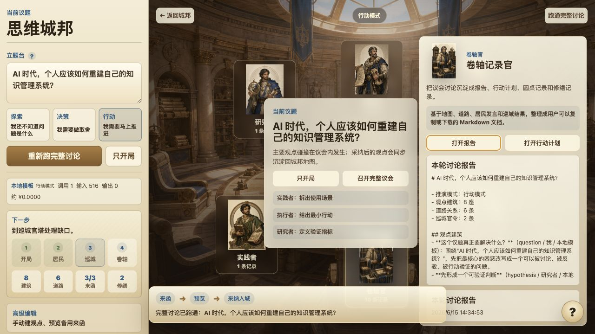
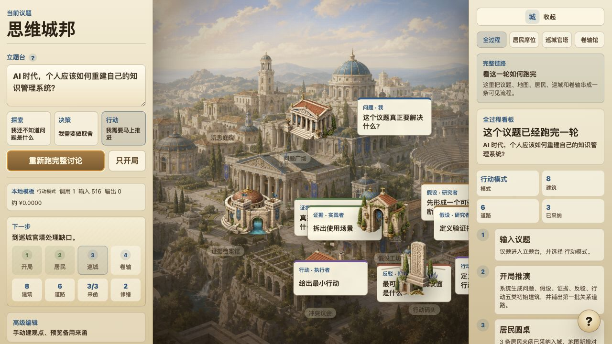
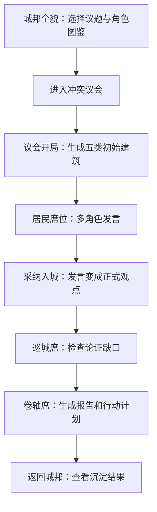
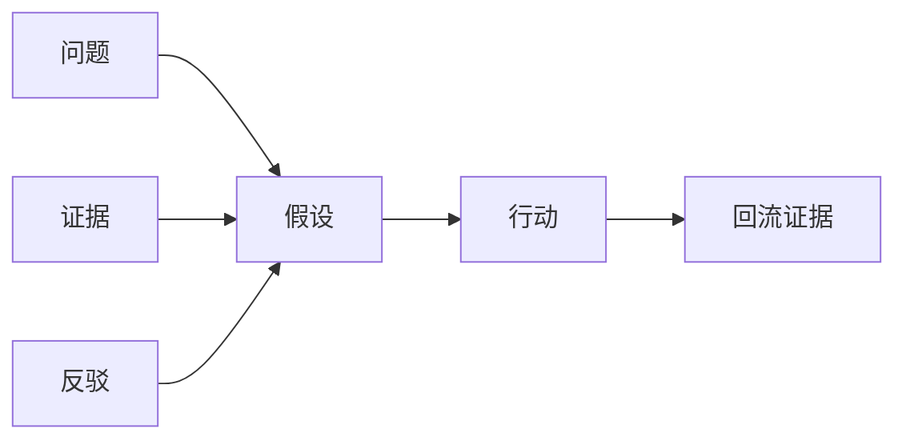
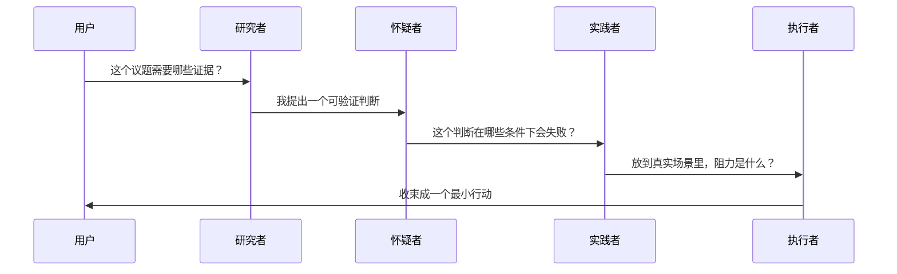
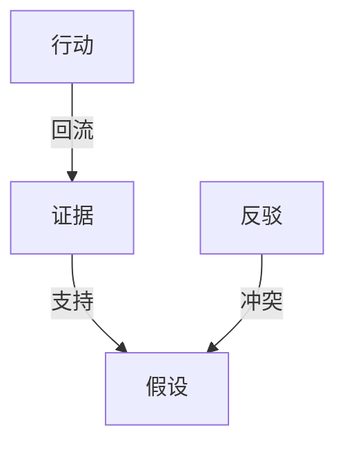
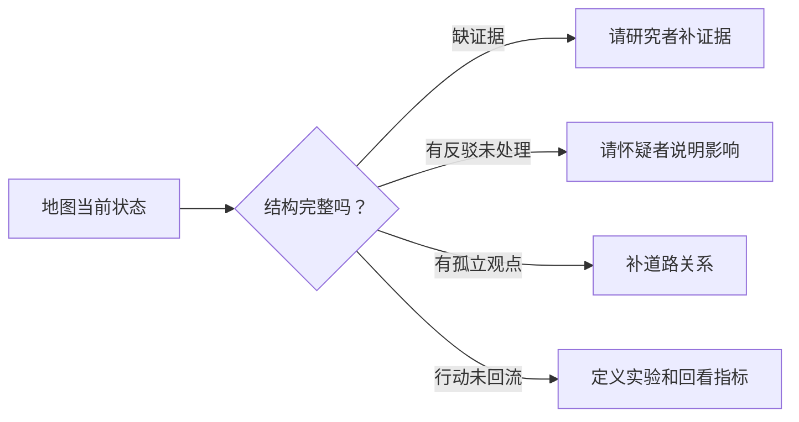
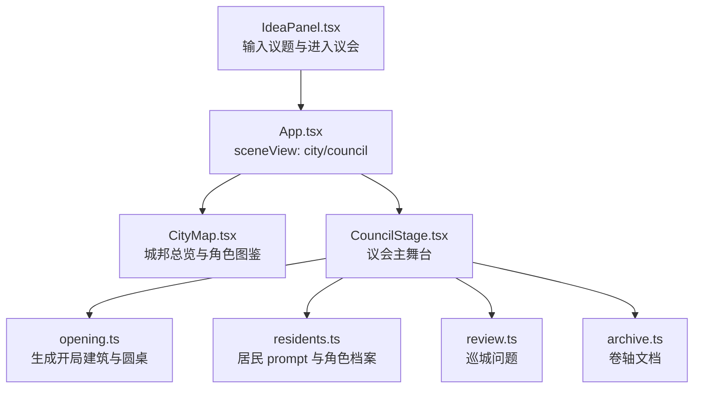
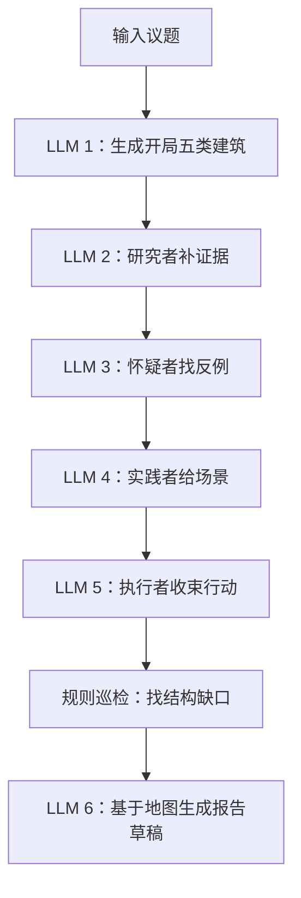

# 思维城邦图文说明书：从模糊议题到思维碰撞 MVP

> 这份说明书的目的，是帮项目发起人重新掌握 Siwei City：它到底想解决什么、当前原型已经做到哪里、一个能讲清楚的 MVP 应该怎样跑完一轮。


## 0. 当前版本的空间结构

最新版本把产品拆成两个场景：

```text
城邦全貌 = 世界观入口 + 角色 / prompt 图鉴 + 讨论结果总览
议会内景 = 思维碰撞 MVP 主场
```

用户先看到城邦全貌。点击“冲突议会”或左侧“进入议会”后，主背景切换到议会内景；四位居民、巡城官、卷轴官都以可点击席位出现。观点碰撞、采纳、巡城和报告查看主要在议会内完成，采纳后的观点再沉淀回城邦地图。



新增核心资产：

- `src/assets/art/scenes/council-chamber-panorama.png`
- `src/assets/art/characters/resident-researcher.png`
- `src/assets/art/characters/resident-skeptic.png`
- `src/assets/art/characters/resident-practitioner.png`
- `src/assets/art/characters/resident-executor.png`
- `src/assets/art/characters/city-inspector.png`
- `src/assets/art/characters/archive-keeper.png`
- `src/assets/art/characters/resident-evidence-cartographer.png`
- `src/assets/art/characters/resident-boundary-skeptic.png`
- `src/assets/art/characters/resident-field-ethnographer.png`
- `src/assets/art/characters/resident-momentum-executor.png`
- `src/assets/art/characters/systems-inspector.png`
- `src/assets/art/characters/report-editor.png`

## 1. 先把这个 idea 重新说清楚

Siwei City 最初的直觉很珍贵：**人的复杂思考不应该只留在聊天记录里，它应该长成一座可以继续修建的城市。**

在这个城市里：

| 城邦物件 | 实际含义 |
| --- | --- |
| 议题 | 用户正在想清楚的问题 |
| 建筑 | 一条观点、假设、证据、反驳或行动 |
| 道路 | 两条观点之间的关系 |
| 居民 | 不同思维角色，比如研究者、怀疑者、实践者、执行者 |
| 巡城官 | 检查当前论证结构哪里断了 |
| 卷轴 | 把讨论沉淀成报告、行动计划和记录 |

所以这个项目不是普通 AI 聊天，也不是普通思维导图。它更像一个**议题工作台**：


## 2. MVP 只验证一个核心问题

当前最小 MVP 不需要做成完整知识管理系统，也不需要一上来支持账号、协作、无限多 agent。

它只需要验证一件事：

> 用户输入一个还没想明白的议题后，能不能通过一轮可视化思维碰撞，得到一张结构地图、一个下一步行动、一份可复盘报告？

这个 MVP 的“可交付结果”有三件：

1. **地图**：用户看见问题、假设、证据、反驳、行动之间的结构。
2. **行动**：用户知道下一步要做什么，而不是只得到一堆观点。
3. **报告**：用户能把本轮讨论带走，用于复盘、分享或继续写作。



## 3. 当前原型里，一轮完整讨论怎么跑

现在项目已经支持从城邦进入议会，再跑完整流程。你可以用这条路径重新体验：

```text
npm run dev
打开 http://127.0.0.1:5173/
输入或保留默认议题
点击“进入议会”
在议会内点击“召开完整议会”
查看四位居民发言、巡城官令和卷轴报告
返回城邦，看观点建筑和角色 prompt 图鉴
```

一轮讨论在产品层面是这样发生的：



### 示例议题

默认议题是：

> AI 时代，个人应该如何重建自己的知识管理系统？

这个议题足够典型，因为它一开始很大、很抽象、很容易变成泛泛而谈。Siwei City 的价值，就是把它拆成可碰撞、可检查、可行动的结构。

## 4. 五类建筑：把思考拆到可讨论

开局阶段会先生成五类建筑。

| 类型 | 用户问题 | 地图上的意义 |
| --- | --- | --- |
| 问题 | 我真正要解决什么？ | 讨论入口 |
| 假设 | 我现在倾向相信什么？ | 可以被证据支持或反驳的判断 |
| 证据 | 我缺什么观察或材料？ | 避免只凭直觉推进 |
| 反驳 | 这个判断哪里可能错？ | 给不同意见留位置 |
| 行动 | 下一步最小动作是什么？ | 把思考推进到现实 |

可以把它理解成一套最小思维骨架：



如果只有问题，没有假设，用户会一直绕圈。
如果只有假设，没有证据和反驳，用户会过早相信自己。
如果没有行动，讨论会变成漂亮但不能推进的地图。

## 5. 居民池：把 AI 从回答者变成碰撞者

MVP 里不应该让 AI 扮演一个“万能助手”。更清楚的做法是让它分成四个思维角色。

| 居民 | 负责什么 | 本轮应该产出 |
| --- | --- | --- |
| 研究者 | 找证据、案例、指标 | 支持或修正假设 |
| 怀疑者 | 找反例、风险、失败条件 | 让判断经受挑战 |
| 实践者 | 放回真实场景 | 检查使用场景和阻力 |
| 执行者 | 收束行动 | 产出最小下一步 |

这四类角色构成一轮“思维碰撞”的最小班底：

当前实现进一步把“功能角色”和“具体居民人格”拆开。居民池里每个功能角色都有男女不同人格、提示词和输出契约；议会桌第一版只从完整居民池里挑一组代表上桌。这样后续可以做成“本轮议题适合邀请哪几位居民”，而不是永远固定同一队人。

| 具体居民 | 功能角色 | 人设差异 |
| --- | --- | --- |
| 证据研究者 | 研究者 | 学院派证据守门人，重来源和指标 |
| 证据制图师 | 研究者 | 女性角色，把证据分层成地形图 |
| 反证怀疑者 | 怀疑者 | 站在反方席位找最强反例 |
| 边界怀疑者 | 怀疑者 | 女性角色，测试边界条件和沉默相关方 |
| 场景实践者 | 实践者 | 从真实工作台和街巷带回经验 |
| 现场民族志员 | 实践者 | 女性角色，用观察笔记还原现场 |
| 行动执行者 | 执行者 | 航线规划式推进，重最小下一步 |
| 推进执行官 | 执行者 | 女性角色，重节奏、责任人和回滚条件 |
| 结构巡城官 | 巡城官 | 检查假设、反驳、孤立建筑和回流 |
| 系统巡检官 | 巡城官 | 女性角色，检查反馈回路和瓶颈 |
| 卷轴记录官 | 卷轴官 | 归档讨论，生成报告和行动计划 |
| 报告编辑官 | 卷轴官 | 女性角色，压缩主线、标出未决问题 |



关键产品约束：**居民发言先是建议，只有用户采纳后才会入城。**

这条边界很重要。它让 AI 参与碰撞，但不替用户直接改判断。

## 6. 道路关系：让讨论不是观点列表

如果只有建筑，地图还是一堆卡片。道路让观点之间产生论证关系。

当前有五类道路：

| 道路 | 含义 | 示例 |
| --- | --- | --- |
| 支持 | A 支撑 B | 证据支持假设 |
| 冲突 | A 挑战 B | 反例挑战判断 |
| 依赖 | A 需要 B 成立 | 行动依赖某个资源 |
| 延伸 | A 推出 B | 问题延伸到行动 |
| 回流 | A 产生新证据回到 B | 实验结果回流验证假设 |

MVP 里最有价值的关系是这三条：



只要这三条成立，项目就能从“AI 帮我想想”变成“我在维护一个可验证的判断系统”。

## 7. 巡城官：把缺口变成下一步

巡城官当前不是 LLM，而是一组固定规则。它检查：

1. 假设有没有证据支撑。
2. 反驳有没有进入议程。
3. 是否存在孤立建筑。
4. 行动有没有回流证据。

这正好对应 MVP 的最小质量标准：



巡城官的角色不是把答案写完，而是逼迫用户看见：这轮讨论还差什么，下一步该修哪里。

## 8. 卷轴馆：MVP 最后必须能拿走

讨论如果只停留在界面里，很容易变成一次漂亮体验。MVP 必须给用户一个“我完成了一轮”的交付物。

所以卷轴馆现在生成四类文档：

| 卷轴 | 用途 |
| --- | --- |
| 本轮讨论报告 | 复盘整个议题结构 |
| 下一步行动计划 | 今天或本周可以执行什么 |
| 居民圆桌记录 | 留下多角色碰撞过程 |
| 巡城修缮记录 | 留下结构缺口和修复建议 |

最小可用报告应该长这样：

```text
# 议题

## 当前判断
- 主要假设是什么

## 证据与缺口
- 已有证据
- 缺失证据

## 反驳与风险
- 最强反面意见
- 需要保留的风险

## 下一步行动
- 最小行动
- 成功或失败怎么看

## 本轮地图
- 观点建筑
- 道路关系
- 巡城问题
```

## 9. 把 MVP 路径收束成一句话

推荐把 Siwei City 的当前 MVP 定义为：

> 输入一个模糊议题，经过四类居民的思维碰撞，生成一张包含问题、假设、证据、反驳和行动的地图；系统巡检结构缺口，并输出下一步行动与可带走的讨论报告。

这句话能同时解释产品、交互和工程边界。

## 10. MVP 应该保留什么，暂时砍掉什么

### 必须保留

- 一个议题输入入口。
- 一键跑完整讨论。
- 地图上的五类建筑。
- 居民圆桌的多角色发言。
- 采纳入城机制。
- 巡城检查。
- 报告和行动计划。

### 暂时不要抢戏

- 太复杂的地图编辑器。
- 多项目管理后台。
- 账号系统。
- 复杂社交协作。
- 大量解释性面板。
- 过多美术入口和支线服务。

MVP 的第一屏应该让用户清楚：**我输入议题，跑一轮，看到结果，拿走下一步。**

## 11. 当前代码如何对应这条路径



如果未来继续改，建议按这个顺序：

1. 先把 `CouncilStage.tsx` 做成真正的主交互空间。
2. 再把 `residents.ts` 的 prompt 体系接入真实 Mimo 调用。
3. 然后把 `archive.ts` 的报告做得更像可交付文档。
4. 最后再做更复杂的地图编辑和历史项目管理。

## 12. 真实 LLM 接入后，完整思维碰撞应该怎样跑

现在本地模板已经能跑通可视流程。真实 LLM 接入后，不建议让模型一次性吐完整报告。更稳的方式是分阶段调用：



每一步都应该产出结构化 JSON，而不是只产出自然语言：

```json
{
  "role": "研究者",
  "title": "补一个可验证判断",
  "body": "这条观点的正文",
  "type": "evidence",
  "respondsTo": "idea-core-question",
  "relation": "支持"
}
```

这样前端才能继续把它变成建筑、道路和卷轴。

## 13. 这套 MVP 的验收标准

一轮 MVP 成功，不看功能数量，看这几个问题：

| 验收问题 | 通过标准 |
| --- | --- |
| 用户知道第一步做什么吗？ | 第一屏只有议题输入和主按钮最突出 |
| 用户能看到讨论发生了吗？ | 地图建筑增加，道路关系出现，圆桌记录可读 |
| 用户能看到碰撞吗？ | 至少有研究者、怀疑者、实践者、执行者四种视角 |
| 用户能看到缺口吗？ | 巡城官能指出证据、反驳、孤立、行动闭环问题 |
| 用户能拿走结果吗？ | 报告和行动计划可以复制或下载 |
| 用户还能继续修吗？ | 建筑、道路、巡检记录都保留在当前城邦里 |

## 14. 推荐的下一步产品路线

### P0：把“全过程看板”做成主体验

现在它已经存在，但还可以更像一个一轮讨论的控制台：

- 显示当前进行到哪一步。
- 每一步有一行解释和一个结果摘要。
- 用户能从这里打开圆桌、巡城、报告和行动计划。

### P1：让报告更有交付感

报告不只是列观点，应该主动整理：

- 当前最可信判断。
- 最大不确定性。
- 最强反驳。
- 下一步行动。
- 回看指标。

### P2：真实居民圆桌

接入 Mimo 后，每个居民都应该读当前地图上下文，再生成下一轮发言。仍然保留“采纳入城”边界。

### P3：道路解释

每条道路增加一句“为什么这条关系成立”。这是从思维导图走向推理工具的关键一步。

## 15. 最后，用一句产品承诺收束

Siwei City 的 MVP 可以这样对用户承诺：

> 给我一个想不清的问题，我帮你把它变成一座可讨论、可检查、可行动、可复盘的思考城市。

这就是这轮原型最应该守住的主线。
